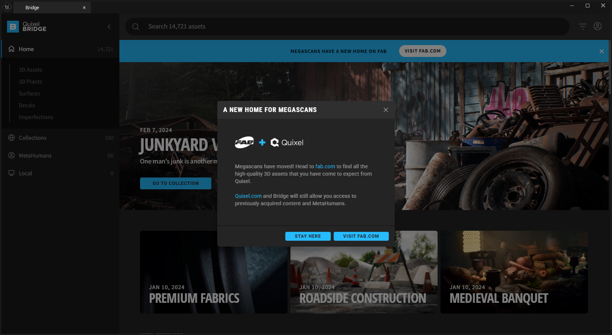
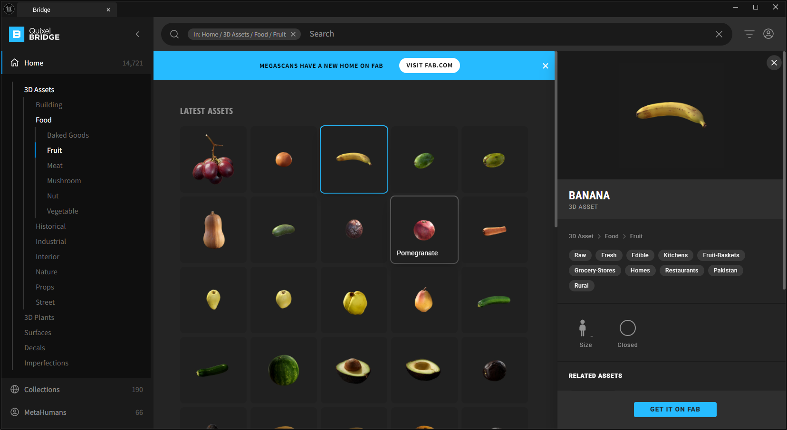
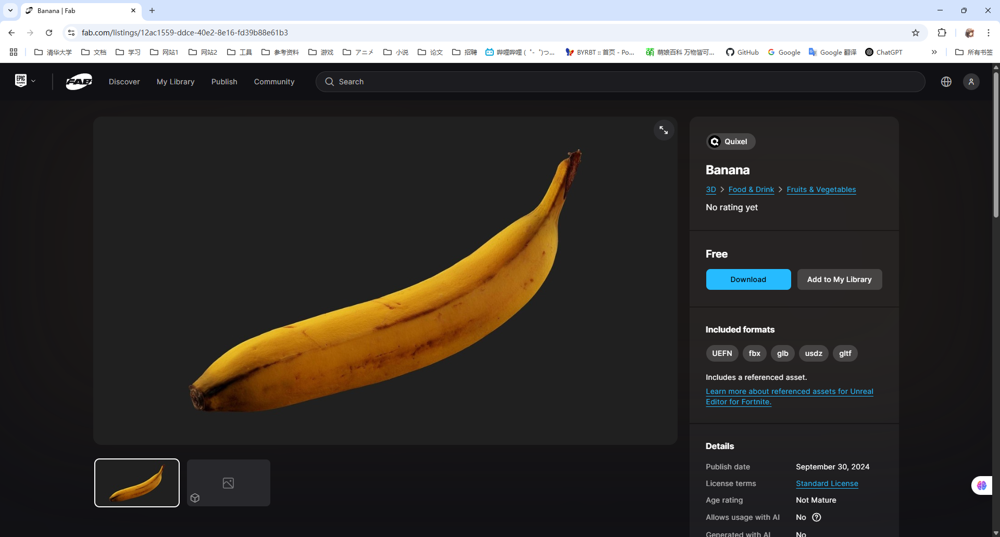
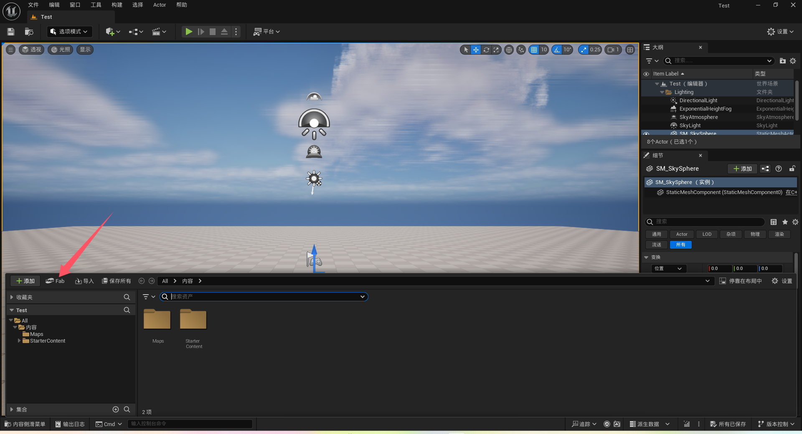
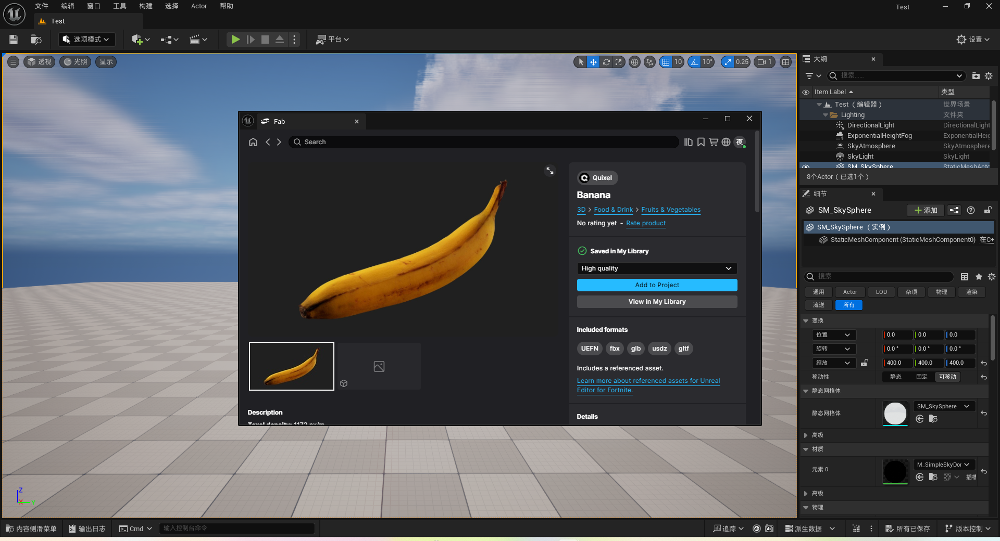
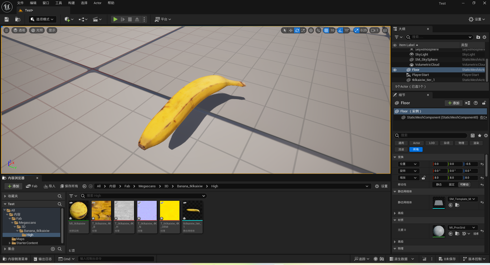
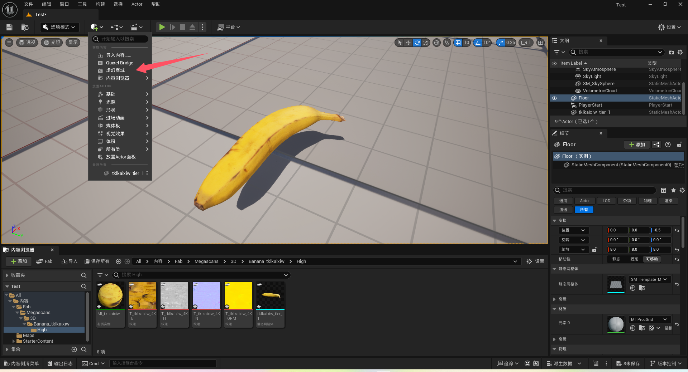

# 虚幻商城

开始学习UE5之后，遇到的第一个问题就是找各种各样的素材。
无论是B站还是Youtube上的教程，大都告诉你可以直接使用Quixel Bridge上的资源。
然而，当你在项目中打开Quixel Bridge的时候，遇到的却是下面这种情况。

提示告诉我们Megascans已经迁移到[虚幻商城](https://fab.com)，
如果点击`STAY HERE`，我们将停留在Quixel Bridge；
如果点击`VISIT FAB.COM`，我们将在浏览器中打开虚幻商城。

如果停留在Quixel Bridge，我们将会发现，
我们没法像以前一样找到自己想要的资产并添加到项目中去，
取而代之的只有`GET IT ON FAB`这个按钮。

点击这个按钮之后，我们将在浏览器中打开虚幻商城中的Quixel页面，
但甚至无法定位到刚才找到的这个资产。
当然，我们可以继续搜索类似的资产，但也只能够下载或者添加到自己的库中。

这实在太麻烦了，明明之前只要选择自己想要的资产就能添加到项目中去的，不是吗？

后来，我终于发现了，现在仍然有类似的方法，只要点击内容浏览器的这个按钮。

这将会可以打开一个编辑器中的小商城页面，在这里你可以找到自己想要的资产并进行其他操作。

此时点击`Add to Project`就可以直接添加到项目中去啦，
与使用Quixel Bridge的感觉一致。

> 请注意，点击这个地方是没有用的！

